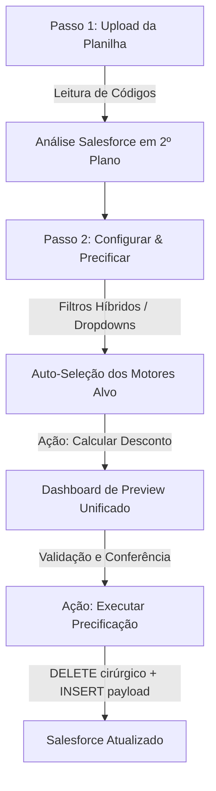

# Documentação Oficial do Sistema de Precificação de Fertilizantes

Esta documentação detalha a arquitetura, regras de negócio, lógica matemática de cálculo e o fluxo de dados da **Central de Precificação de Fertilizantes**.

---

## 1. Visão Geral do Sistema

O objetivo principal deste sistema é automatizar a precificação em lote de fertilizantes no **Salesforce**, substituindo processos manuais complexos que envolviam o uso do Salesforce Inspector, PROCVs manuais no Excel e scripts fragmentados.

O sistema opera de forma **cirúrgica**: ele lê uma planilha de precificação com custos e margens de produtos, identifica os motores de precificação correspondentes no Salesforce (por filial ou campanha), realiza a remoção exclusiva (DELETE) dos descontos antigos daqueles produtos específicos e, em seguida, insere (INSERT) os descontos novos recalculados com precisão milimétrica.

---

## 2. O Fluxo de Trabalho (Workflow em 2 Passos)

O sistema foi estruturado no formato **Wizard Progressivo** com foco na usabilidade, organizando o trabalho em apenas duas etapas integradas:



### Passo 1: Upload da Planilha
1. O usuário faz o upload da planilha Excel (aba **Cálculos**).
2. O sistema realiza a leitura automatizada da coluna de **Código do Produto** (identificada via termos como "CÓDIGO" ou "ITEM").
3. A listagem de códigos extraídos é exibida na tela. O avanço ao passo seguinte fica liberado.
4. Ao clicar em **"Avançar"**, o backend faz uma chamada de descoberta silenciosa no Salesforce para verificar quais produtos já possuem registros de preços no ERP e carregar a lista de motores de destino.

### Passo 2: Configurar & Precificar (Painel Unificado)
1. **Dropdowns Pesquisáveis de Campanha e Filial:**
   * O sistema exibe seletores interativos baseados no que está cadastrado no Salesforce para aqueles produtos.
   * O usuário clica para abrir a lista completa de opções ou digita letras para buscar em tempo real.
   * Cada opção traz um contador de motores vinculados (ex: `🏢 ALFENAS [1 motor(es)]`).
   * Quando uma opção é selecionada, o sistema aplica o filtro correspondente instantaneamente.
2. **Filtro de Motores Ativos:**
   * Por padrão, exibe e opera apenas sobre motores ativos.
   * Desmarcando o checkbox **"Apenas Motores Ativos"**, o usuário habilita motores inativos, permitindo a precificação antecipada de campanhas planejadas que ainda não estrearam.
3. **Seleção Híbrida Inteligente:**
   * **Modo Padrão:** O sistema autoseleciona em segundo plano os motores corretos com base na Campanha/Filial filtrada.
   * **Modo Avançado (Manual):** Clicando em "Seleção Avançada", o usuário abre uma gaveta onde pode visualizar individualmente a lista física de motores e marcar/desmarcar checkboxes manualmente.
4. **Dashboard de Preview:**
   * Clicando em **"Calcular Desconto"**, a ferramenta calcula os preços e monta o dashboard completo abaixo.
   * A tabela exibe colunas detalhadas de Código, Filial, Motor, Campanha, UF, Custos e as margens, mostrando o **desconto com precisão de 8 casas decimais** para conferência matemática.
5. **Execução Final (DELETE ➡️ INSERT):**
   * Confirmada a consistência física e matemática no Dashboard, o usuário clica em **"Executar Precificação"** para iniciar a atualização de dados no Salesforce em segundo plano com acompanhamento de logs via WebSocket em tempo real.

---

## 3. Lógica SOQL (Descoberta de Motores)

Para listar os motores associados a filiais e campanhas, o extrator backend (`ator2_extrator.py`) realiza queries SOQL nas tabelas de associação do Salesforce. 

### Relação Motor ➡️ Filiais
O sistema realiza a consulta nos motores vinculados às filiais (`BranchModifierEngine__c`):
```sql
SELECT ModifierEngine__c, ModifierEngine__r.Name, Branch__r.Name, ModifierEngine__r.IsActive__c
FROM BranchModifierEngine__c
```

### Relação Motor ➡️ Campanhas
O sistema realiza a consulta nas campanhas atreladas aos motores (`CampaignModifierEngine__c`):
```sql
SELECT ModifierEngine__c, Campaign__r.Name, ModifierEngine__r.IsActive__c
FROM CampaignModifierEngine__c
```

O backend consolida esses cruzamentos em um dicionário único de motores, registrando o ID, nome do motor, a lista de campanhas válidas, a lista de filiais correspondentes, a UF do motor e se ele está ativo (`"active": true/false`).

---

## 4. A Lógica Matemática de Precificação

A planilha de upload é a **dona exclusiva** das colunas de `CUSTO` e `MARGEM`. O cálculo matemático de desconto de cada produto é executado conforme os passos abaixo:

### Passo A: Preço de Partida
O preço de partida representa o preço mínimo necessário para cobrir os custos e atingir a margem desejada do produto, ajustado com taxas fiscais padrão (1.0069 e 0.99075):

$$Preço\ de\ Partida = \left( \frac{Custo}{1 - Margem} \right) \times \frac{1.0069}{0.99075}$$

### Passo B: Preço de Catálogo do ERP
O precificador consulta no Salesforce (`PricebookEntry`) os preços originais do produto na tabela de catalogação correspondente à UF da filial selecionada (ex: catalogações `CONTRIBUINTE|MG|MG` ou `CONTRIBUINTE|SP|SP`):
```sql
SELECT Product2.ProductCode, UnitPrice, Pricebook2.Name 
FROM PricebookEntry 
WHERE Product2.ProductCode IN ('1174', '22252', ...) 
  AND Pricebook2.Name IN ('CONTRIBUINTE|MG|MG', 'CONTRIBUINTE|SP|SP')
```
*Se a filial pertencer a MG, busca o preço do catálogo de MG. Se pertencer a SP, busca do catálogo de SP.*

### Passo C: Preço ERP Final
O Preço ERP final é calculado aplicando-se uma margem fixa padrão de 4% sobre o preço de catálogo original:

$$Preço\ ERP = Preço\ de\ Catálogo\ original \times 0.96$$

### Passo D: Taxa de Desconto Final
A taxa de desconto que será gravada no Salesforce é a diferença percentual entre o Preço ERP e o Preço de Partida do produto:

$$Desconto\ (%) = \left( 1 - \frac{Preço\ de\ Partida}{Preço\ ERP} \right) \times 100$$

> [!NOTE]
> Essa taxa de desconto é exibida no Dashboard com **8 casas decimais** (`toFixed(8)`) para permitir a validação cirúrgica comparada ao Excel.

---

## 5. A Lógica de Execução (DELETE Cirúrgico ➡️ INSERT Limpo)

O pipeline unificado de atualização é executado em segundo plano e realiza um processo de duas fases para garantir consistência total de dados, evitando duplicidades de chaves primárias.

### Fase 1: Deleção Cirúrgica (DELETE)
* **Objetivo:** Remover descontos antigos que existiam nos motores alvo *apenas* para os produtos que constam na planilha atualizada.
* **Processo:**
  1. O sistema faz uma query SOQL buscando os IDs de registros existentes dos produtos nos motores selecionados:
     ```sql
     SELECT Id, ProductCode__c, ModifierEngine__r.Name FROM ProductsModifierEngine__c
     WHERE ProductCode__c IN ('1174', '22252', ...) AND ModifierEngine__r.Name IN ('Motor Selecionado A', ...)
     ```
  2. Extrai os IDs reais dos registros de precificação que precisam ser deletados.
  3. **Segurança:** Salva um backup completo em `/logs/backups/` dos registros antes de removê-los.
  4. Executa o **DELETE** no Salesforce usando Composite API (para lotes menores) ou Bulk API (lotes massivos), garantindo que dados de produtos não listados na planilha continuem intactos.

### Fase 2: Inserção Limpa (INSERT)
* **Objetivo:** Inserir os registros novos recalculados com a taxa de desconto final obtida na fase de cálculo matemático.
* **Processo:**
  1. Constrói o payload de inserção ligando o ID do produto (`Product__c`), ID do motor modificador (`ModifierEngine__c`) e o desconto final (`Discount__c`).
  2. Realiza o **INSERT** de forma limpa no Salesforce.
  3. O progresso é enviado em tempo real por WebSocket para exibição nos logs visuais da tela.
